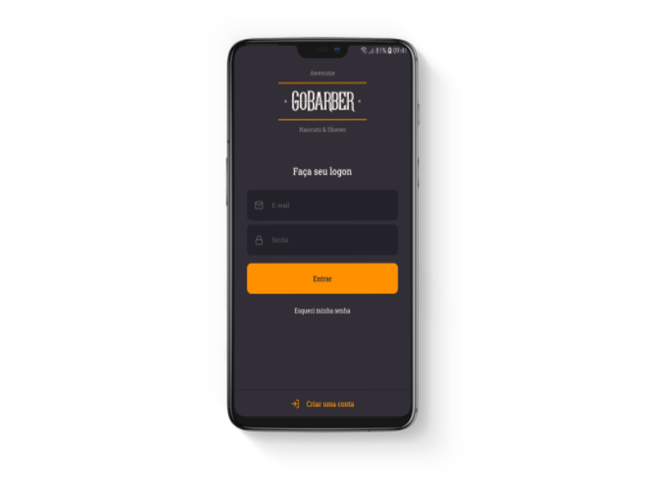
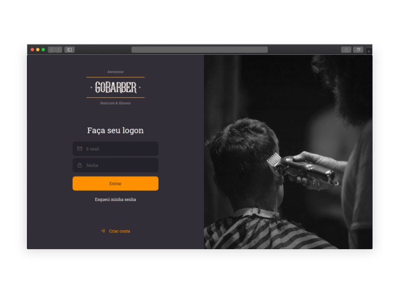

<h1 align="center">
	
</h1>

- [REST API](https://github.com/kilsonrs/gobarber-ts-api)
- [Web client](https://github.com/kilsonrs/gobarber-ts-web)
- [Mobile client](https://github.com/kilsonrs/gobarber-ts-app)

## 📝 License

This project is licensed under the MIT License - see the [LICENSE](LICENSE) file for details.

---

by Kilson  👋 &nbsp;[See my linkedin](https://www.linkedin.com/in/kilsonrs/)
